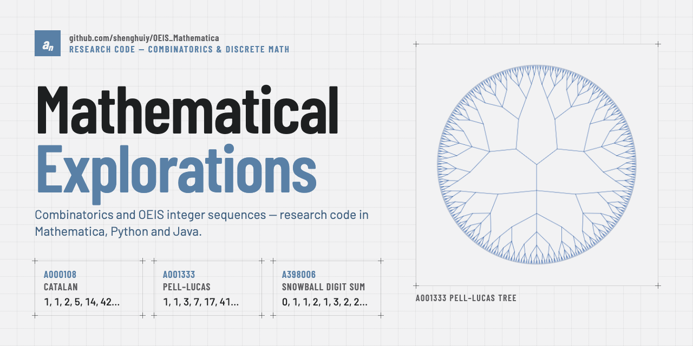

# Mathematical Explorations

Code for exploring OEIS sequences, doing advanced math research, and having fun along the way.

  <picture>
    <source media="(prefers-color-scheme: dark)" srcset="docs/img/banner-dark.png">
    
  </picture>

## Documentation

Explanations of the code in this repository are in [`docs/`](docs/README.md).

### Functions

- [Carry-less (dismal) arithmetic in Java](docs/CarrylessArithmetic.md): `src/java/CarrylessArithmetic.java`, its methods, and how to call it from Java and from Mathematica via J/Link.
- [DivisorSigmaInverse](docs/DivisorSigmaInverse.md): `src/wolfram/DivisorSigmaInverse.wl`, a Mathematica port of `invsigmaDiv` from Max Alekseyev's `invphi.gp`; `invSigmaDivisors[n, k]` lists every x with σₖ(x) equal to each divisor of n, `DivisorSigmaInverse[n, k]` gives the solutions for n itself, and `DivisorSigmaInverseCount[n, k]` counts them.
- [EulerPhiInverse](docs/EulerPhiInverse.md): `src/wolfram/EulerPhiInverse.wl`, a compiled depth-first search for every x with φ(x) = n; `EulerPhiInverse[n]` returns them sorted.

### Wolfram Function Repository

Functions published in the Wolfram Function Repository, linked directly since they have no pages in `docs/`:

- [FoataTransform](https://resources.wolframcloud.com/FunctionRepository/resources/FoataTransform/): Foata's fundamental transformation of a permutation.
- [InverseFoataTransform](https://resources.wolframcloud.com/FunctionRepository/resources/InverseFoataTransform/): the inverse of Foata's fundamental transformation.
- [FindFanoPlaneIsomorphism](https://resources.wolframcloud.com/FunctionRepository/resources/FindFanoPlaneIsomorphism/): finds an isomorphism between Fano planes.
- [ParkingFunctionQ](https://resources.wolframcloud.com/FunctionRepository/resources/ParkingFunctionQ/): tests whether a list is a parking function.
- [ParkingFunctionToDyckWords](https://resources.wolframcloud.com/FunctionRepository/resources/ParkingFunctionToDyckWords/): converts a parking function to Dyck words.

### OEIS sequences

- [A316667](docs/A316667.md): `src/wolfram/A316667.wl`, the trapped knight walk on the square-spiral chessboard.
- [A399539](docs/A399539.md): `src/wolfram/A399539.wl`, a compiled segmented sieve for numbers k with ψ(k) − φ(k) = d(k)⁴, with timings and the checks run in Mathematica.
- [A157196](docs/A157196.md): `src/wolfram/A157196.wl`, a string construction for the self-describing sequence of 1s and 2s, with the checks run in Mathematica.
- [A003785](docs/A003785.md): `src/wolfram/A003785.wl`, a Mathematica translation of the OEIS PARI program built from eta-function products.

Tests for the Java code are described in [`test/java/README.md`](test/java/README.md), and tests for the Wolfram code in [`test/wolfram/README.md`](test/wolfram/README.md).

## License

[MIT](LICENSE)
