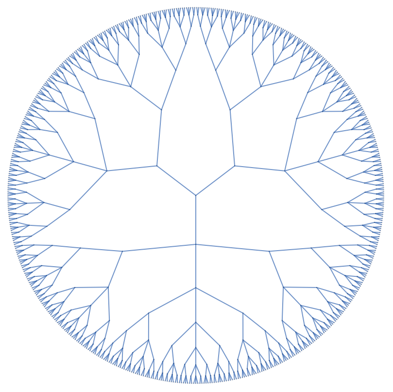

# Mathematical Explorations

Code for exploring OEIS sequences, doing advanced math research, and having fun along the way.

## Documentation

Explanations of the code in this repository are in [`docs/`](docs/README.md):

- [Carry-less (dismal) arithmetic in Java](docs/CarrylessArithmetic.md): `src/java/CarrylessArithmetic.java`, its methods, and how to call it from Java and from Mathematica via J/Link.
- [A399539](docs/A399539.md): `src/wolfram/A399539.wl`, a compiled segmented sieve for numbers k with ψ(k) − φ(k) = d(k)⁴, with timings and the checks run in Mathematica.
- [A157196](docs/A157196.md): `src/wolfram/A157196.wl`, a string construction for the self-describing sequence of 1s and 2s, with the checks run in Mathematica.
- [A003785](docs/A003785.md): `src/wolfram/A003785.wl`, a Mathematica translation of the OEIS PARI program built from eta-function products.
- [DivisorSigmaInverse](docs/DivisorSigmaInverse.md): `src/wolfram/DivisorSigmaInverse.wl`, a Mathematica port of `invsigmaDiv` from Max Alekseyev's `invphi.gp`; `invSigmaDivisors[n, k]` lists every x with σₖ(x) equal to each divisor of n, and `DivisorSigmaInverse[n, k]` gives the solutions for n itself.

Tests for the Java code are described in [`test/java/README.md`](test/java/README.md), and tests for the Wolfram code in [`test/wolfram/README.md`](test/wolfram/README.md).
