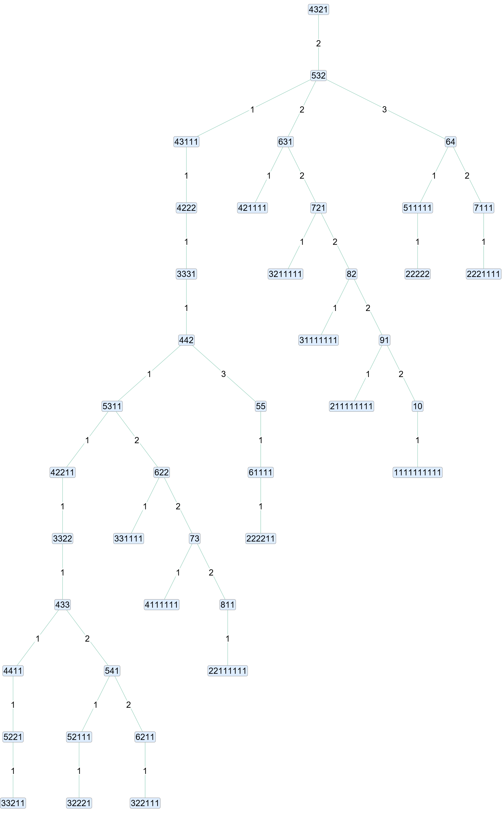

# Bulgarian solitaire

`src/wolfram/BulgarianSolitaire.wl` is a Wolfram Language package (context `OEIS`) for Bulgarian solitaire on integer partitions. A move takes one card from every pile and makes a new pile of those cards. In partition terms, `B(λ) = (t, λ₁ − 1, …, λ_t − 1)` where t is the number of parts, zeros are dropped, and the result is re-sorted. The package follows five papers:

- B. Hopkins, *30 Years of Bulgarian Solitaire*, College Math. J. 43 (2012): history, the move, Garden of Eden partitions, and the row-to-column game.
- T. Hart, G. Khan, M. Khan, *Revisiting Toom's proof of Bulgarian solitaire*, Ann. Sci. Math. Québec 36 (2012): the diagonal criterion for cycles, and Brandt's necklace count.
- B. Hopkins and J. Sellers, *Exact enumeration of Garden of Eden partitions*, Integers 7(2) (2007) A19.
- H. Eriksson and M. Jonsson, *Level sizes of the Bulgarian solitaire game tree*, Fibonacci Quart. 55 (2017).
- P. Ellis, *Bulgarian Solitaire*, Westchester Area Math Circle slides (2019): the cycles for 8 and 17 cards.

Partitions are lists of positive integers in non-increasing order, so `{6, 4, 3, 1, 1}` is five piles. A function that takes a partition gives a message (`BulgarianSolitaireStep::partition`, and so on) and returns `$Failed` when its first argument is not one: `OEIS`BulgarianSolitaireStep[{1, 2}]` and `OEIS`BulgarianSolitaireStep[{}]` both fail this way. `BulgarianSolitairePeriodicPartition` does the same for a necklace that is not a nonempty list of 0s and 1s (`BulgarianSolitairePeriodicPartition::necklace`). The functions of an integer `n` give `::posint` (for example `BulgarianSolitaireCycleCount::posint`) and return `$Failed` when `n` is not a positive integer, and `BulgarianSolitaireQuasiLevelSize` and `BulgarianSolitaireQuasiLeafSize` give `::nonnegint` when `d` is not a nonnegative integer.

**Notation.** `F(m)` is the m-th Fibonacci number: F(0) = 0, F(1) = 1, F(m) = F(m−1) + F(m−2), so F(0), F(1), F(2), … is 0, 1, 1, 2, 3, 5, 8, 13, 21, 34, 55, … In Wolfram code `F(m)` is `Fibonacci[m]`, and in the Python port it is the helper `_fib(m)`. `p(m)` is the number of partitions of m, `PartitionsP[m]` in Wolfram.

## Loading and calling

From the repository root:

```wolfram
Get["src/wolfram/BulgarianSolitaire.wl"];
OEIS`BulgarianSolitaireStep[{6, 4, 3, 1, 1}]      (* {5, 5, 3, 2} *)
```

Nothing is compiled, so loading and the first call are instant. The computations below run in the interpreter, so run them in your own Wolfram kernel.

## Python version

`src/python/bulgarian_solitaire.py` is a standard-library port with the same functions in snake case (`step`, `orbit`, `cycle`, `distance`, `is_periodic`, `cycles`, `cycle_count`, `is_garden_of_eden`, `garden_of_eden_count`, `garden_of_eden_partitions`, `preimages`, `graph`, `levels`, `level_sizes`, `leaf_sizes`, `quasi_level_size`, `quasi_leaf_size`, `row_moves`, `periodic_partition`, `basin_levels`, `basin_level_sizes`, `max_distance`, `cycle_lengths`, `component`, `reversed_tree`). Partitions are tuples, and `graph` returns a dict from each partition to its image instead of a `Graph`, and `reversed_tree` a dict from each partition to its children. The tests in `test/python/test_bulgarian_solitaire.py` mirror the Wolfram ones; run them from the repository root with `python -m unittest discover -s test/python`. All 46 tests pass (Python 3, about 7 s). The functions check their arguments like the Wolfram ones, and raise `ValueError` with the same wording (`is not a partition`, `is not a necklace`, `is not a positive integer`, `is not a nonnegative integer`) where the Wolfram functions give a message and `$Failed`. A partition is a nonempty tuple of positive integers in non-increasing order, and a necklace a nonempty list or tuple of 0s and 1s.

## Public functions

| Call | Returns |
|---|---|
| `BulgarianSolitaireStep[p]` | The partition after one move. |
| `BulgarianSolitaireOrbit[p]` | `p`, its image, and so on, stopping just before the first partition that repeats. |
| `BulgarianSolitaireCycle[p]` | The cycle `p` ends in, starting with the first cycle partition reached. A fixed point is a cycle of length 1. |
| `BulgarianSolitaireDistance[p]` | The number of moves before `p` first reaches its cycle (0 for a cycle partition). |
| `BulgarianSolitairePeriodicQ[p]` | Whether `p` lies on a cycle, by Toom's diagonal criterion (no iteration). |
| `BulgarianSolitaireCycles[n]` | Every cycle of partitions of `n`, each rotated to start at its smallest partition. |
| `BulgarianSolitaireCycleCount[n]` | The number of cycles of partitions of `n`, from Brandt's necklace formula, without building partitions. |
| `BulgarianSolitaireGardenOfEdenQ[p]` | Whether `p` has no preimage, that is, its rank `p₁ − t` is at most −2. |
| `BulgarianSolitaireGardenOfEdenCount[n]` | The number of Garden of Eden partitions of `n`, `ge(n) = p(n−3) − p(n−9) + p(n−18) − …` ([A123975](https://oeis.org/A123975): 0, 0, 1, 1, 2, 3, 5, 7, 10, 14, 20, …). |
| `BulgarianSolitaireGardenOfEdenPartitions[n]` | The Garden of Eden partitions of `n`. |
| `BulgarianSolitairePreimages[p]` | The partitions that one move sends to `p`. |
| `BulgarianSolitaireGraph[n, opts]` | The directed graph on the partitions of `n`, edge λ → B(λ). Options go to `Graph`. |
| `BulgarianSolitaireLevels[n]` | The partitions of `n` grouped by distance to the cycles. |
| `BulgarianSolitaireLevelSizes[n]` | The size of each group. For `n = k(k+1)/2` these are the level sizes of the game tree rooted at the staircase. |
| `BulgarianSolitaireLeafSizes[n]` | The number of Garden of Eden partitions in each group, that is, the leaves on each level. |
| `BulgarianSolitaireQuasiLevelSize[d]` | The level size `F(2d)` (1 for `d = 0`) of the quasi-infinite game, `k → ∞`. |
| `BulgarianSolitaireQuasiLeafSize[d]` | The leaf count `(F(2d−2) − F(d−1))/2` of the quasi-infinite game. |
| `BulgarianSolitaireRowMoves[p]` | The partitions reached by changing any one row of the Ferrers diagram into a column. |
| `BulgarianSolitairePeriodicPartition[w]` | The cycle partition for the necklace `w`, a list of m + 1 beads (1 = filled cell on diagonal m + 1, 0 = empty). |
| `BulgarianSolitaireBasinLevelSizes[p]` | The number of partitions at each distance from the cycle `p` ends in, counting only the partitions that flow into that cycle. Level 0 is the cycle. |
| `BulgarianSolitaireMaxDistance[n]` | The largest distance to a cycle over all partitions of `n`, the height of the game tree. For `n = k(k+1)/2` it is `k(k−1)` (Igusa). |
| `BulgarianSolitaireCycleLengths[n]` | The sorted lengths of the cycles of partitions of `n`, one entry per cycle. |
| `BulgarianSolitaireComponent[p]` | The connected component of `p`: its cycle and every partition that flows into it, ordered by distance from the cycle. |
| `BulgarianSolitaireReversedTree[p, opts]` | The component of `p` with the edges reversed (each partition points to its preimages), without the edges into the cycle. Options go to `Graph`. |

`n` is a positive integer.

## Examples

The 15-card game that opens Hopkins' article:

```wolfram
OEIS`BulgarianSolitaireOrbit[{6, 4, 3, 1, 1}]
```

```
{{6, 4, 3, 1, 1}, {5, 5, 3, 2}, {4, 4, 4, 2, 1}, {5, 3, 3, 3, 1},
 {5, 4, 2, 2, 2}, {5, 4, 3, 1, 1, 1}, {6, 4, 3, 2}, {5, 4, 3, 2, 1}}
```

```wolfram
OEIS`BulgarianSolitaireCycle[{6, 4, 3, 1, 1}]      (* {{5, 4, 3, 2, 1}} *)
OEIS`BulgarianSolitaireDistance[{6, 4, 3, 1, 1}]   (* 7 *)
```

Cycles. The partitions of 8 have two (Ellis, Hopkins), and 17 is the first n with three:

```wolfram
OEIS`BulgarianSolitaireCycles[8]
OEIS`BulgarianSolitaireCycleCount /@ Range[12]     (* {1, 1, 1, 1, 1, 1, 1, 2, 1, 1, 1, 2} *)
OEIS`BulgarianSolitaireCycleCount[17]              (* 3 *)
```

Garden of Eden partitions. `(4, 4, 3, 3, 2, 2, 2)` has rank −3 and no preimage; `(6, 5)` has two preimages:

```wolfram
OEIS`BulgarianSolitaireGardenOfEdenQ[{4, 4, 3, 3, 2, 2, 2}]   (* True *)
OEIS`BulgarianSolitairePreimages[{6, 5}]                      (* {{7, 1, 1, 1, 1}, {6, 1, 1, 1, 1, 1}} *)
OEIS`BulgarianSolitaireGardenOfEdenCount[20]                  (* p(17) − p(11) + p(2) = 190 *)
OEIS`BulgarianSolitaireGardenOfEdenCount /@ Range[20]         (* A123975 *)
```

Level sizes of the game tree for 10 cards (k = 4), the tree of Figure 2 in Eriksson and Jonsson, which has 42 vertices and height k(k − 1) = 12:

```wolfram
OEIS`BulgarianSolitaireLevelSizes[10]   (* {1, 1, 3, 5, 5, 3, 4, 4, 4, 3, 3, 3, 3} *)
OEIS`BulgarianSolitaireLeafSizes[10]    (* {0, 0, 0, 1, 3, 1, 1, 1, 2, 1, 1, 0, 3}, 14 leaves in all *)
OEIS`BulgarianSolitaireGraph[10, VertexLabels -> "Name"]
```

Level sizes of one cycle: the necklace BW repeated ℓ times (Pham, Harris–Nguyen):

```wolfram
OEIS`BulgarianSolitaireBasinLevelSizes[OEIS`BulgarianSolitairePeriodicPartition[{1, 0, 1, 0, 1, 0, 1, 0}]]
```

For ℓ = 4 (n = 32) this gives `{2, 1, 3, 7, 14, 24, 28, 18}`; for ℓ = 5 (n = 50) `{2, 1, 3, 7, 15, 32, 60, 92, 96, 54}`.

Height, cycle lengths, components and the reversed tree:

```wolfram
OEIS`BulgarianSolitaireMaxDistance /@ Range[16]
(* {0, 0, 2, 2, 3, 6, 4, 5, 7, 12, 8, 8, 9, 14, 20, 15}: k(k−1) at n = 3, 6, 10, 15 *)
OEIS`BulgarianSolitaireCycleLengths /@ {8, 17}                      (* {{2, 4}, {3, 6, 6}} *)
Length[OEIS`BulgarianSolitaireComponent[{6, 4, 3, 1, 1}]]           (* 176 = p(15): one component *)
OEIS`BulgarianSolitaireReversedTree[{4, 3, 2, 1}, VertexLabels -> "Name"]
```

<picture>
  <source media="(prefers-color-scheme: dark)" srcset="img/BulgarianSolitaireTree10-dark.png">
  
</picture>

The picture above is Figure 2 of Eriksson and Jonsson: the partitions as digit strings, and each edge labelled with the index `j` of the part played in the reverse move. It is a recursive `Tree` whose children are an `Association` `j -> subtree`, so `Tree` draws the keys as edge labels (`Tree[root, <|1 -> Tree[…], 2 -> Tree[…]|>]`); the script is `img/BulgarianSolitaireTree10.wl`. It leaves out the loop `1` from the staircase to itself, which the paper draws as a leaf `T`. The last call is the game tree for 10 cards drawn from the root, with 42 vertices and 41 edges (`TreeGraphQ` is `True`). For a cycle of length above 1, such as `{2, 1, 1}` (the cycle of partitions of 4), the result is a forest with one tree hanging from each cycle partition.

### With Young tableaux

The Function Repository's [HookLengths](https://resources.wolframcloud.com/FunctionRepository/resources/HookLengths/) and [StandardYoungTableaux](https://resources.wolframcloud.com/FunctionRepository/resources/StandardYoungTableaux/) take a partition, so they apply directly to the partitions here (the first call downloads the function).

The hook lengths of the 15-card starting partition, and of the staircase it ends on, whose hooks are the odd numbers 1, 3, …, 2k − 1 along each row:

```wolfram
ResourceFunction["HookLengths"][{6, 4, 3, 1, 1}]   (* {{10, 7, 6, 4, 2, 1}, {7, 4, 3, 1}, {5, 2, 1}, {2}, {1}} *)
ResourceFunction["HookLengths"][{5, 4, 3, 2, 1}]   (* {{9, 7, 5, 3, 1}, {7, 5, 3, 1}, {5, 3, 1}, {3, 1}, {1}} *)
```

The hook length formula `n!/∏ hooks` counts the standard Young tableaux of a shape without listing them. Along the orbit of `{6, 4, 3, 1, 1}` it gives

```wolfram
hookCount[p_] := Total[p]!/Times @@ Flatten[ResourceFunction["HookLengths"][p]];
hookCount /@ OEIS`BulgarianSolitaireOrbit[{6, 4, 3, 1, 1}]
(* {231660, 96525, 75075, 100100, 125125, 210210, 175175, 292864} *)
```

and the last value is the staircase (A005118: 1, 2, 16, 768, 292864, 1100742656, … for k = 1, 2, …). `StandardYoungTableaux` lists them for small shapes, and agrees with the formula:

```wolfram
ResourceFunction["StandardYoungTableaux"][{2, 1}]                  (* {{{1, 2}, {3}}, {{1, 3}, {2}}} *)
Length[ResourceFunction["StandardYoungTableaux"][{4, 3, 2, 1}]]   (* 768 *)
Total[hookCount[#]^2 & /@ IntegerPartitions[8]]                    (* 40320 = 8! *)
```

The last line is the Robinson–Schensted identity: the squares of the tableau counts over the partitions of n add up to n!.

## How it works

1. **The move.** `Sort[Append[DeleteCases[p - 1, 0], Length[p]], Greater]`.
2. **Orbits.** The orbit is followed with an `Association` of seen partitions. The first repeat gives both the cycle and the distance (the position of the repeat).
3. **Periodic partitions.** Draw the partition as checkers on a board with row i holding the i-th part, and let `diag[k]` be the cells with `i + j − 1 = k`. A move never carries a checker from `diag[k]` to `diag[k+1]`. Write `m(m+1)/2 ≤ n < (m+1)(m+2)/2` and `r = n − m(m+1)/2`. The partitions of n on a cycle are exactly those with `k` cells on `diag[k]` for `k ≤ m`, `r` cells on `diag[m+1]`, and none beyond (Toom, Theorem 2.1). `BulgarianSolitairePeriodicQ` counts the diagonals, without iterating.
4. **Cycles.** Any choice of r of the m + 1 cells on `diag[m+1]` gives a periodic partition: row i has `m + 1 − i` cells on the smaller diagonals, plus one if its cell is chosen. `BulgarianSolitaireCycles` builds one partition per choice, iterates the move to get its cycle, rotates the cycle to start at its smallest partition, and removes duplicates. A move rotates `diag[m+1]`, so the cycles are the necklaces of m + 1 beads with r marked, and `BulgarianSolitaireCycleCount` evaluates Burnside's sum `(1/(m+1)) Σ_{d | gcd(m+1, r)} φ(d) C((m+1)/d, r/d)`. `BulgarianSolitaireCycles` visits `C(m+1, r)` choices, so use the count for large n.
5. **Garden of Eden partitions.** `(λ₁, …, λ_t)` has a preimage for each distinct part `v ≥ t − 1`: add 1 to every other part and append `v − t + 1` ones. There is none exactly when `λ₁ − t ≤ −2`. Dyson's rank generating function sums to `Σ ge(n) qⁿ = (Σ p(n) qⁿ)(Σ_{j≥1} (−1)^(j+1) q^(3j(j+1)/2))`, which is the formula `BulgarianSolitaireGardenOfEdenCount` uses.
6. **Levels.** `BulgarianSolitaireLevels[n]` groups the partitions by distance to the cycles. The periodic partitions come first; then each level is the preimages of the previous one that are not periodic. The preimage table is built once with `GroupBy[IntegerPartitions[n], step]`, so the cost is that of listing all p(n) partitions.
7. **Quasi-infinite tree.** Eriksson and Jonsson fix the level d and let k → ∞. The generating function for the level sizes of the reversed tree with its loop at the staircase is `g(x) = (1 − x)/(1 − 3x + x²)`, with `g_d = F(2d+1)`. Without the loop, the number of partitions at distance d is `F(2d)` (A088305). The leaves have `ℓ(x) = (x³ − x⁴)/((1 − x − x²)(1 − 3x + x²))`, so `ℓ_d = (F(2d−2) − F(d−1))/2` (A094292 up to an initial zero). For `n = k(k+1)/2` the actual level sizes equal `F(2d)` for `d ≤ ⌊k/2⌋` (Theorem 5.1), and level `⌊k/2⌋ + 1` is short by 1 for odd k and by `1 + k/2` for even k.
8. **Row-to-column moves.** In Hopkins' two-player game a move changes any row of the Ferrers diagram into a column. Removing row j lowers every column of height at least j by 1, and the removed cells form a new column whose height is the length of row j. Row 1 is the ordinary move. Starting from `{n}`, the first move is forced to `{n − 1, 1}`, and the second gives `{n − 2, 2}` or `{n − 2, 1, 1}`.
9. **One cycle's basin and Pham's limit.** A cycle is a necklace of m + 1 beads, a bead being 1 (black, B) where a cell of diagonal m + 1 is filled; row i of the partition has `m + 1 − i` cells on the smaller diagonals plus its bead (Pham's difference labelling from the staircase, with 1 = B and 0 = W). `BulgarianSolitaireBasinLevelSizes` walks backward through the preimages from the cycle, so it visits only that cycle's basin, not all p(n) partitions. Pham (arXiv 2208.14496) studies the necklace P repeated k times: the level sizes of the basin converge as k grows to the coefficients of a rational function `H_P(x)`. For P = BW, `H_BW(x) = (x − 1)²(3x + 2)/(x³ − 3x² − x + 1) = 2 + x + 3x² + 7x³ + 15x⁴ + 33x⁵ + 71x⁶ + 155x⁷ + …` (Theorem 1.1; I checked it against the paper's text), and for a primitive P of length at least 3 the denominator has degree at most |P| and the numerator degree at most 2|P| (Theorem 1.2). She conjectures that the degree of the denominator is exactly |P|, and that `H_P` and `H_P*` have the same denominator, where P* is P read backwards with the colours swapped (Conjecture 1.1 of Harris–Nguyen, arXiv 2308.05321, who prove it for `BW^k` and `B(WB)^k`, the latter with `H_B(WB)^k = H_W(BW)^k`). In the data, the first levels of the basin of `P^k` agree with the series for about 2k terms (for example 13 of 14 for BWW with k = 6 and 12 for BWWW with k = 6), more than the k levels I first checked for BW (ℓ = 2 to 9, where level ℓ is the first that differs: ℓ = 8 gives 334 where the series has 335, the cycle has length 2, and the height is 2ℓ − 1).

Pham also conjectures that `|O_(P^k)| = c_P^(k−1) |O_P|` with `c_P = c_P*` (for BWW and BBW, `c = 5`); that is a statement about orbit sizes and is not checked here.

## Checks

The tests in `test/wolfram/BulgarianSolitaire.wlt` all pass in Mathematica 15.0.1 (107 cases). To run them:

```wolfram
TestReport["test/wolfram/BulgarianSolitaire.wlt"]
```

They check:

- The examples in the papers: the 15-card orbit, the 8-card cycles, three cycles for 17 cards, the rank −3 example, Gardner's three Garden of Eden partitions for n = 6, and the preimages of `(6, 5)`.
- Igusa's partition `(k−1, k−1, k−2, …, 2, 1, 1)` being k(k−1) moves from the staircase, for k = 3 to 8.
- Toom's criterion against iterating the move, and `BulgarianSolitaireCycles` against the cycles reached from every partition of n for n ≤ 18.
- `BulgarianSolitaireCycleCount` against `Length[BulgarianSolitaireCycles[n]]` for n ≤ 40.
- `BulgarianSolitaireGardenOfEdenCount` against a direct count for n ≤ 40, and `BulgarianSolitairePreimages` against a brute-force search for n ≤ 14.
- The level sizes for 6 and 10 cards (the latter read off Figure 2 of Eriksson and Jonsson, with the 42 vertices and 14 leaves accounted for), the tree height k(k−1) for k = 2 to 7, and Theorem 5.1 for k = 3 to 8, including the deficit at level `⌊k/2⌋ + 1`.
- The generating functions for `F(2d)` and the leaf counts against the closed forms.
- `BulgarianSolitaireMaxDistance` against the largest `BulgarianSolitaireDistance` for n ≤ 14 and against k(k−1) for k = 2 to 7, the cycle lengths for 8, 12, 17 and 20, the components of the cycles partitioning the partitions of n for n ≤ 14, and the reversed tree for 10 cards (42 vertices, 41 edges, a tree).

### Checking Pham's conjecture on more necklaces

Only the first 2k or so levels of the basin of `P^k` match the limit, so the series can be read off without building the whole basin: grow the preimages from the cycle for D = 3|P| + 3 levels with k = D/2 + 1 repeats (and k + 1, which must give the same D terms), then fit the smallest rational function with denominator degree at most |P| and numerator degree at most 2|P|, leaving two spare equations. This reproduces Pham's closed forms for BWW (= BBW), BWWW, BBBW, BBWW and BWWWW, including the denominators `1 − x² − 2x³`, `1 − x² − 4x³ − 6x⁴`, `1 − x² − 2x³ − 3x⁴` and `1 − 2x³ − 8x⁴ − 12x⁵`. For the primitive necklaces with |P| = 3, 4 and 5 (all 2, 3 and 6 of them, which form 1, 2 and 3 pairs {P, P*}), `H_P` and `H_P*` have the same denominator, of degree exactly |P| in every case; the series are even equal for BWW/BBW, BBWW (its own dual) and the pair of length 5 with `H = 5 + 2x + 5x² + 9x³ + …`, and differ only in the numerator for BWWW/BBBW, BWWWW/BBBBW and BBWWW/BBBWW. Run it with `python src/python/pham_conjecture.py 3 5` (`pham_conjecture.py` is stdlib-only and uses `bulgarian_solitaire.py`).
